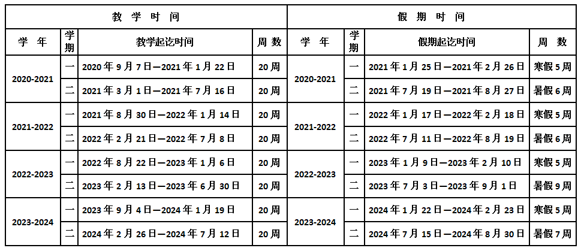

# 校历

[教学校历](https://jwc.hqu.edu.cn/sy/jxxl.htm)

[作息时间](https://jwc.hqu.edu.cn/sy/zxsjb.htm)

| 课程 | 时间 |
| :--- | :--- |
| 第一节 | 8:00～8:50 |
| 第二节 | 9:00～9:50 |
| 课间休息 | 9:50～10:10 |
| 第三节 | 10:10～11:00 |
| 第四节 | 11:10～12:00 |
| 第五节 | 自习 |
| 第六节 | 自习 |
| 第七节 | 14:30～15:20 |
| 第八节 | 15:30～16:20 |
| 课间休息 | 16:20～16:30 |
| 第九节 | 16:30～17:20 |
| 第十节 | 17:30～18:20 |
| 第十一节 | 19:10～20:00 |
| 第十二节 | 20:10～21:00 |
| 第十三节 | 21:10～22:00 |

