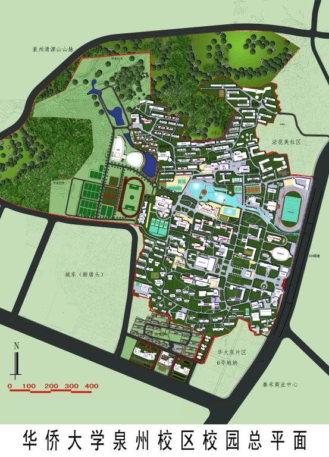
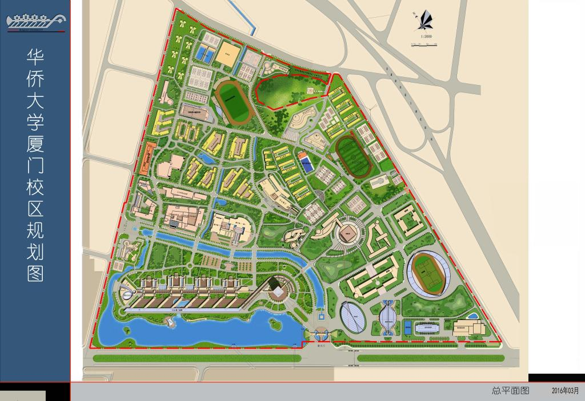

# 建筑与设施

## 校园地图

* 泉州校区

* 厦门校区

## 厦门校区的主要建筑

### A区

A区为行政办公研发大楼，因为是整个厦门校区楼层最高的大楼，共26层高，因此又称之为主楼或26楼。

### B区

### C区（机电&土木）

### D区（信息&计算机&建筑）

### E区（化工&材料&马克思）

### F区（统计&新传&哲社&音舞）

### G区（王源兴国际会议中心）

### 林广场学术交流中心（招待所）

### 李碧葱音乐舞蹈大楼

### 泛华科技大楼

### 李朝耀大楼

### 机电信息实验大楼

### 土木工程学院学科实验大楼

### 综合实验大楼（新建）

### 四端文物馆

### 郑年锦图书馆

### 羽网馆

### 灯光篮球场

### 操场

### 露天游泳馆

### 后勤服务楼（中庭）

### 凤系餐厅

### 紫荆餐厅（123）

### 宿舍楼

#### 凤凰苑 

#### 刺桐苑（社区中心）

#### 紫荆苑

#### 莲苑

#### 梅苑

## 泉州校区的主要建筑（暂无）

## 3D全景漫游

* [https://3d.hqu.edu.cn/](https://3d.hqu.edu.cn/)

## 校内地图

* [https://gis.hqu.edu.cn/cmipsh5/\#/](https://gis.hqu.edu.cn/cmipsh5/#/)

## 图片版权

* ？

